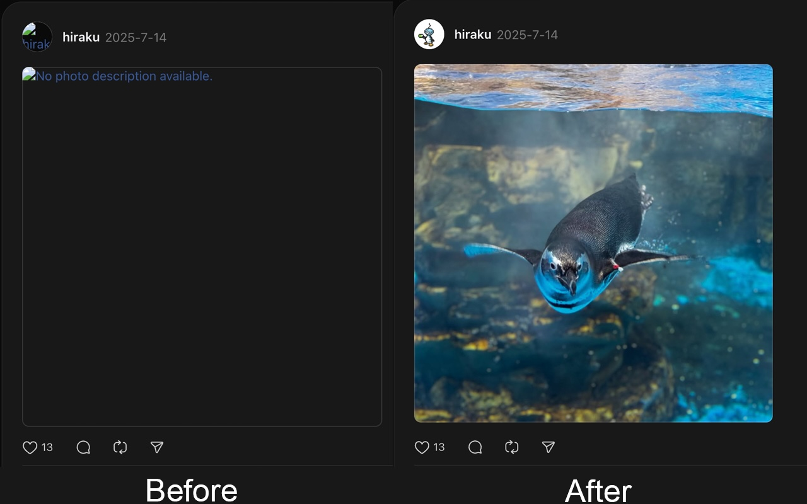

# Threads Image Fix

[中文說明](README.zh-TW.md)

A browser extension that fixes image loading issues on Threads by modifying CORS (Cross-Origin Resource Sharing) headers.

## Overview

This extension resolves image loading problems on Threads (threads.net) caused by Cross-Origin Resource Policy restrictions. It automatically modifies response headers from CDN servers to allow cross-origin image loading.

## How It Works

The extension uses the Declarative Net Request API to modify response headers from Facebook CDN and Instagram CDN servers:

- **Target domains**: `fbcdn.net`, `cdninstagram.com`
- **Modified header**: `cross-origin-resource-policy` → `cross-origin`

This allows Threads to properly load images from these CDN servers without CORS restrictions.

## Chrome / Edge

Install from [Chrome Web Store](https://chromewebstore.google.com/detail/threads-image-fix/eeomhegfoafjagmofalcpjgecibdccgo)

## Firefox

Install from [Firefox Add-ons](https://addons.mozilla.org/firefox/addon/threads-image-fix/)

## Safari / Userscript

The `declarativeNetRequest` API in Safari has some bugs that prevent it from working properly, so we provide a userscript instead.

### Installation

1. Install [Userscripts](https://apps.apple.com/app/userscripts/id1463298887) from the App Store (free)
2. Open Safari → Settings → Extensions → Enable Userscripts
3. Click the Userscripts icon in Safari toolbar, then click the "folder" button in the top left corner. Finder will automatically open a folder

4. Download [`threads-image-fix.user.js`](Userscript/threads-image-fix.user.js) and save it to that folder
5. Visit Threads, then click the Userscripts icon again. You should see the script listed (you must visit Threads first, otherwise it won't show up)
6. Refresh the page and images will be fixed

## Privacy

This extension:
- ✅ Does NOT collect any user data
- ✅ Does NOT track browsing history
- ✅ Only modifies headers for specified CDN domains
- ✅ Works entirely locally in your browser
