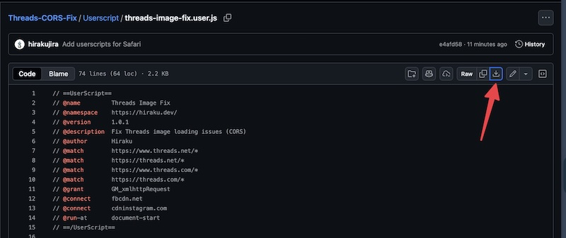

# Threads Image Fix

[English](README.md)

一個透過修改 CORS 修復 Threads 破圖問題的瀏覽器附加元件。

## 概述

此擴充功能解決 Threads 因 CORS 限制導致的圖片載入問題。它會自動修改 CDN 伺服器的回應標頭，以允許圖片載入。

## 運作原理

此擴充功能使用 Declarative Net Request API 修改來自 Facebook CDN 和 Instagram CDN 伺服器的回應標頭：

- **目標網域**：`fbcdn.net`、`cdninstagram.com`
- **修改的標頭**：`cross-origin-resource-policy` → `cross-origin`

這讓 Threads 能夠正確載入這些 CDN 伺服器的圖片。

## Chrome / Edge

從 [Chrome 線上應用程式商店](https://chromewebstore.google.com/detail/threads-image-fix/eeomhegfoafjagmofalcpjgecibdccgo) 安裝

## Firefox

從 [Firefox 附加元件](https://addons.mozilla.org/firefox/addon/threads-image-fix/) 安裝

## Safari / Userscript

Safari 的 `declarativeNetRequest` API 存在一些問題，導致無法正常運作，因此以下提供 userscript 方法作為替代方案。

### 安裝步驟

1. 從 App Store 安裝 [Userscripts](https://apps.apple.com/app/userscripts/id1463298887)（免費）
2. 開啟 Safari → 設定 → 延伸功能 → 啟用 Userscripts
3. 點擊 Safari 工具列中的 Userscripts 圖示，按左上角的「資料夾」按鈕，Finder 會自動開啟一個資料夾

4. 下載 [`threads-image-fix.user.js`](Userscript/threads-image-fix.user.js) 並把檔案丟到該資料夾內

5. 前往 Threads，再點擊 Userscripts 圖示，應該會看到腳本已經出現（一定要前往 Threads 不然不會顯示）
6. 重新整理頁面，圖片就會修正了

## 隱私權

此擴充功能：
- ✅ 不會收集任何使用者資料
- ✅ 不會追蹤瀏覽紀錄
- ✅ 僅修改指定 CDN 網域的標頭
- ✅ 完全在您的瀏覽器本機運作
